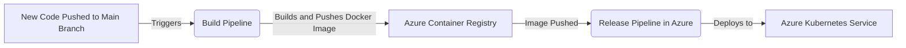

# Terl Bank acount mangment system 
**taks requiremtns**
 Your task is to develop a backend for a banking platform capable of serving the following functions through APIs:
 1-Withdraw cash from an account
 2-  Deposit cash to an account
 3- Transfer money from one account to another
# Main Component digram 

# Fund Transfer Solution
**External Fund Transfer**
1. Save Transaction as Initial
Save the transaction details as the initial step.
2. Trigger Money Hold Event
Initiate a money hold event, transferring funds internally from the source account to our GL account.
3. Receive Hold GL Amount Acknowledgment
Wait for acknowledgment confirming the successful hold of the GL amount.
4. Process Money to Swift
If the hold is successful, proceed to process the money to Swift.
If successful, initiate the GL clearance process to withdraw the amount from GL to the Swift settlement account.
5. Handle Swift Message Failure
If the Swift message is not successful, initiate the refund process, transferring money from the GL account back to the source account.

**Internal Fund Transfer**

## Automated CI/CD Pipeline Process

### Process Overview

The diagram below illustrates the automated CI/CD pipeline process for deploying new code changes to the main branch:

### Process Description

1. **Code Commit to Main Branch**: Developers push their new code changes to the main branch in the repository. This is the starting point of the CI/CD pipeline.

2. **Build Pipeline Activation**: The push to the main branch triggers an automated build pipeline. This pipeline is responsible for compiling the code, running tests, and building the application, thereby creating a new version.

3. **Docker Image Creation and Push**: Upon a successful build, the pipeline creates a Docker image of the application. This Docker image is then pushed to the Azure Container Registry, a private registry for hosting container images.

4. **Release Pipeline Trigger**: The successful push of the Docker image to the Azure Container Registry automatically triggers the release pipeline in Azure DevOps.

5. **Deployment to Azure Kubernetes Service (AKS)**: The release pipeline takes the new Docker image and deploys it into the Azure Kubernetes Service. AKS manages the deployment, scaling, and operations of the application within Kubernetes.
