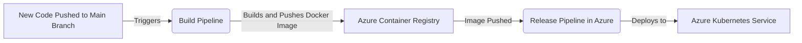

# Telr Bank acount mangment  
**task Objectives**

 to develop a backend for a banking platform capable of serving the following functions through APIs:
 
 1. Withdraw cash from an account.
 2. Deposit cash to an account
 3. Transfer money from one account to another.
    
# Main Component digram 
  there are three microservices 
  
1.**Account Management**: Responsible for processing operations such as creating accounts, withdrawing cash, and depositing cash.

2.**Account Enquery**: Responsible for handling read operations related to accounts.  

3.**Fund transfer**: Manages fund transfers between accounts, both internal and external, and also maintains transaction history.

# Fund Transfer Solution

**External Fund Transfer**
1. Save Transaction as Initial:
   Save the transaction details as the initial step.
3. Trigger Money Hold Event :
   Initiate a money hold event, transferring funds internally from the source account to our GL account.
5. Receive Hold GL Amount Acknowledgment:
    Wait for acknowledgment confirming the successful hold of the GL amount.
7. Process Money to Swift:
   If the hold is successful, proceed to process the money to Swift.
   If successful, initiate the GL clearance process to withdraw the amount from GL to the Swift settlement account.
9. Handle Swift Message Failure:
   If the Swift message is not successful, initiate the refund process, transferring money from the GL account back to the source account.

## Technical solution

**Microservices Architecture for Business Component Segregation and High Availability**

1. Utilizing a microservices architecture to segregate business components ensures a modular and scalable design.
2. The architecture enhances high availability by allowing independent scaling and deployment of microservices.
3. Each microservice focuses on a specific business capability, promoting maintainability and flexibility.
  
**Geographical Saga Pattern for Fund Transfer Process with Kafka Communication**
1. Employing the geographical Saga pattern to manage the fund transfer process.
2. Kafka serves as the communication backbone between microservices, ensuring reliable and asynchronous communication.
   he Saga pattern helps maintain consistency in distributed transactions across multiple microservices.
   
**Event Sourcing for Account State Management and Persistence**

1. Leveraging Event Sourcing to manage the state of accounts.
2. Events represent state changes, providing a historical record of account transactions.
3. This approach facilitates auditability, traceability, and rebuilding the account state at any point in time.
   
**CQRS (Command Query Responsibility Segregation) for High Availability**

1. Implementing CQRS to segregate the command (write) and query (read) responsibilities.
2. Enhances high availability by allowing for independent scaling of read and write components.
3. Write operations and read queries are handled by separate services, optimizing performance and resource utilization.

## Recommended and Desirable Enhancements for Transitioning from Task to Microservices Standard

1. Incorporating a Security Layer with OAuth2 and Encryption.
2. Implementing Service Discovery and Circuit Breakers.
3. Adopting an API Gateway.
4. Embracing Service Mesh Architecture.
5. Utilizing Logging Stack, Kibana, and Elasticsearch for efficient search capabilities.
6. Ensuring Comprehensive Test Case Coverage and Implementing Code Quality Gates in the Pipeline.

These enhancements are suggested for transitioning from a task-oriented approach to a microservices standard, emphasizing security, resilience, scalability, and overall system robustness.

 ## API collection 

**swagger documentation**:

1.**Account Management**: http://20.233.77.247/telr/swagger-ui/index.html# 

2.**Account Enquery**: http://20.233.102.246/telr/swagger-ui/index.html#

3.**Fund transfer**: http://20.233.160.125/telr/swagger-ui/index.html#

**APIS**:

 
 | Name                  | Method | URL                                                                                                                                                                                                          | Request Headers                               | Request Body                                                                                                                                                                                                                                                     | Response |
| --------------------- | ------ | ------------------------------------------------------------------------------------------------------------------------------------------------------------------------------------------------------------ | --------------------------------------------- | ---------------------------------------------------------------------------------------------------------------------------------------------------------------------------------------------------------------------------------------------------------------- | -------- |
| InternalTransfer      | POST   | [http://20.233.160.125/telr/api/v1/transfer/internal](http://20.233.160.125/telr/api/v1/transfer/internal)                                                                                                   | accept: _/_ Content-Type: application/json | `json {"amount": 300, "sourceAccountId": "b9b4de2f-6683-489d-9a2d-1a927b06bbe9", "destinationAccountId": "dbe2d4ba-5e1f-48bc-8974-fea18cdb0edd", "beneficiaryName": "Masa Ahmed", "currency": "AED", "fundTransferType": "INTERNAL"}`                            | \-       |
| FundTransferSuccess   | POST   | [http://20.233.160.125/telr/api/v1/transfer/external](http://20.233.160.125/telr/api/v1/transfer/external)                                                                                                   | accept: _/_ Content-Type: application/json | `json {"amount": 1000.0, "sourceAccountId": "b9b4de2f-6683-489d-9a2d-1a927b06bbe9", "destinationAccountId": "334333343", "beneficiaryName": "Ahmed", "currency": "AED", "bankSwiftCode": "ADIBEGBIXXX", "bankName": "CITI bank", "destinationCurrency": "USDD"}` | \-       |
| FundTransferRefund    | POST   | [http://20.233.160.125/telr/api/v1/transfer/external](http://20.233.160.125/telr/api/v1/transfer/external)                                                                                                   | accept: _/_ Content-Type: application/json | `json {"amount": 1000.0, "sourceAccountId": "b9b4de2f-6683-489d-9a2d-1a927b06bbe9", "destinationAccountId": "334333343", "beneficiaryName": "Ahmed", "currency": "AED", "bankSwiftCode": "ADIBEGBIXXX", "bankName": "CITI bank", "destinationCurrency": "USDD"}` | \-       |
| List All Transactions | GET    | [http://20.233.160.125/telr/api/v1/transactions?page=0&size=10](http://20.233.160.125/telr/api/v1/transactions?page=0&size=10)                                                                               | accept: _/_                                   | \-                                                                                                                                                                                                                                                               | \-       |
| Get TransactionById   | GET    | [http://20.233.160.125/telr/api/v1/transactions/sw0602429f-e77d-4b8c-b5f9-7b5b7d35c626170313711666040](http://20.233.160.125/telr/api/v1/transactions/sw0602429f-e77d-4b8c-b5f9-7b5b7d35c626170313711666040) | accept: _/_                                   | \-                                                                                                                                                                                                                                                               | \-       |
| CreateAccount         | POST   | [http://20.233.77.247/telr/api/v1/account/create](http://20.233.77.247/telr/api/v1/account/create)                                                                                                           | accept: _/_ Content-Type: application/json | `json {"fullName": "Ahmed Osman", "accountType": "SAVINGS", "balance": 7000}`                                                                                                                                                                                    | \-       |
| CashWithdrawal        | PUT    | [http://20.233.77.247/telr/api/v1/account/withdraw/b9b4de2f-6683-489d-9a2d-1a927b06bbe9](http://20.233.77.247/telr/api/v1/account/withdraw/b9b4de2f-6683-489d-9a2d-1a927b06bbe9)                             | accept: _/_ Content-Type: application/json | `json {"amount": 500}`                                                                                                                                                                                                                                           | \-       |
| CachDeposit           | PUT    | [http://20.233.77.247/telr/api/v1/account/deposit/b9b4de2f-6683-489d-9a2d-1a927b06bbe9](http://20.233.77.247/telr/api/v1/account/deposit/b9b4de2f-6683-489d-9a2d-1a927b06bbe9)                               | accept: _/_ Content-Type: application/json | `json {"amount": 20500}`                                                                                                                                                                                                                                         | \-       |
| AccountById           | GET    | [http://20.233.102.246/telr/api/v1/account/b9b4de2f-6683-489d-9a2d-1a927b06bbe9](http://20.233.102.246/telr/api/v1/account/b9b4de2f-6683-489d-9a2d-1a927b06bbe9)                                             | accept: _/_                                   | \-                                                                                                                                                                                                                                                               | \-       |
| ListAllAcounts        | GET    | [http://20.233.102.246/telr/api/v1/account?page=0&size=10](http://20.233.102.246/telr/api/v1/account?page=0&size=10)                                                                                         | accept: _/_                                   | \-                                                                                                                                                                                                                                                               | \-       |

## Automated CI/CD Pipeline Process

### Process Overview

The diagram below illustrates the automated CI/CD pipeline process for deploying new code changes to the main branch:

### Process Description

1. **Code Commit to Main Branch**: Developers push their new code changes to the main branch in the repository. This is the starting point of the CI/CD pipeline.

2. **Build Pipeline Activation**: The push to the main branch triggers an automated build pipeline. This pipeline is responsible for compiling the code, running tests, and building the application, thereby creating a new version.

3. **Docker Image Creation and Push**: Upon a successful build, the pipeline creates a Docker image of the application. This Docker image is then pushed to the Azure Container Registry, a private registry for hosting container images.

4. **Release Pipeline Trigger**: The successful push of the Docker image to the Azure Container Registry automatically triggers the release pipeline in Azure DevOps.

5. **Deployment to Azure Kubernetes Service (AKS)**: The release pipeline takes the new Docker image and deploys it into the Azure Kubernetes Service. AKS manages the deployment, scaling, and operations of the application within Kubernetes.

## Tools and technology stack used :

- MongoDB
- MySQL
- kafka
- mongock & flayway
- Spring-Boot 3.1.5
- Java 17
- azure k8 cluster
- azure pipeline
- mocking : https://app.wiremock.cloud/mock-apis/ez8jk/stubs/7ba9fe1b-cff5-4682-8964-1b12f1b91779?q=

To run the services it already deployed in azure cloud and you can run services loacal just chage the profile to lacal using "-Dspring.profiles.active=cloud"

## Reference and resources  

1. https://medium.com/@hugo.oliveira.rocha/what-they-dont-tell-you-about-event-sourcing-6afc23c69e9a
2. https://martinfowler.com/microservices/
3. https://docs.axoniq.io/reference-guide/architecture-overview/event-sourcing
4. https://www.baeldung.com/cs/saga-pattern-microservices
5. https://www.udemy.com/course/spring-boot-microservices-cqrs-saga-axon-framework/
   
   

